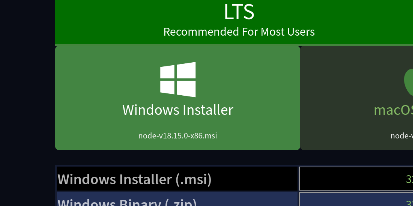
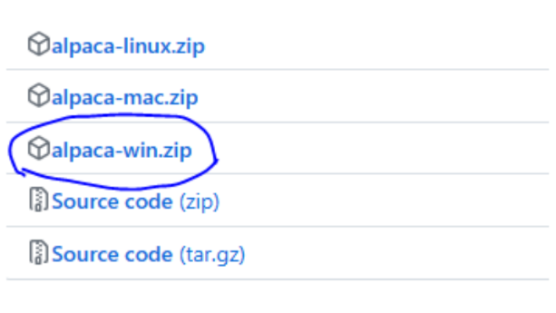
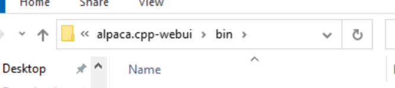
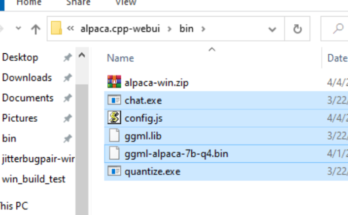
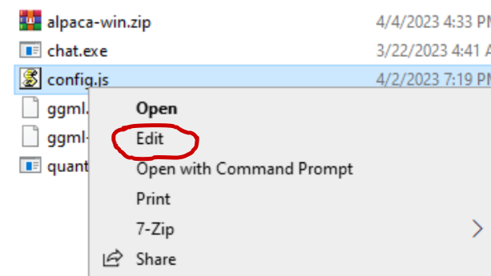
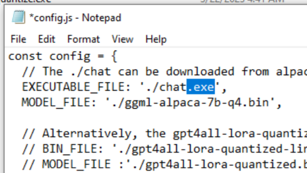
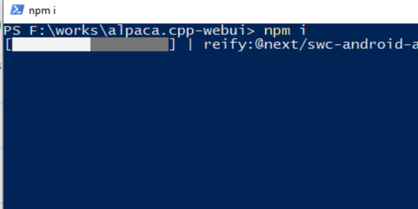
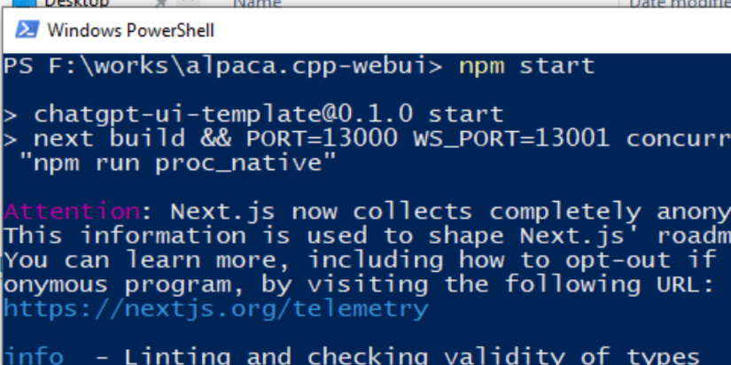

# Guide for Windows

Install nodejs v18+:

Download the windows build for alpaca.cpp:

Go to `{PROJECT_DIR}/bin`

Extract the zip file

You should have these files in `bin` folder

Edit the `config.js`

Add `.exe` to the executable name:

Go back to `{PROJECT_DIR}`

Open a new terminal and run `npm i`

Run `npm start`

If you see error `child process exited with code ...`, make sure that you have enough available RAM to load the model. (For 7B, it's recommended to have at least 8GB of RAM)

Then, visit `http://localhost:13000`

